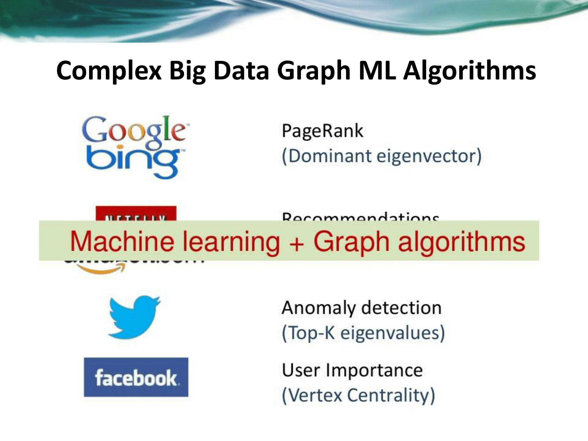
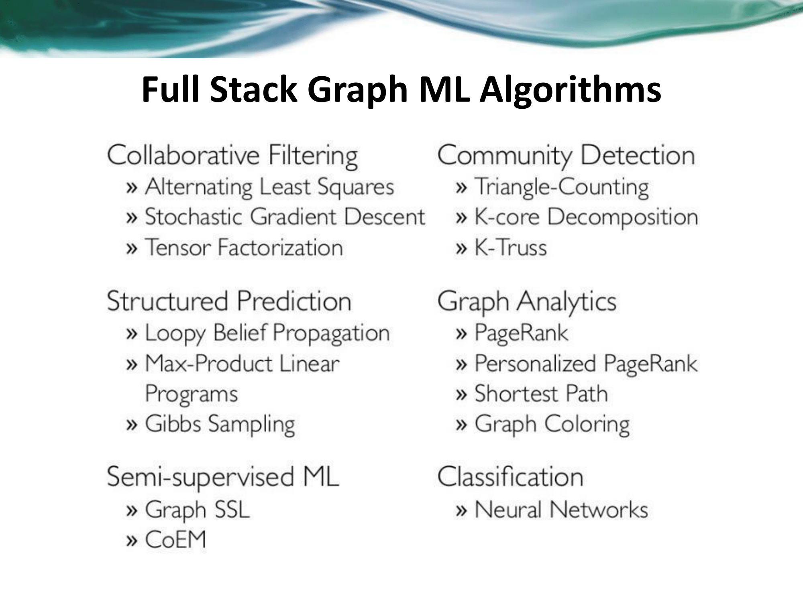

# Anomaly Detection \(Outlier Detection\)

## Top Resources

* [**Introduction to Anomaly Detection: Concepts and Techniques \| My views of the World and Systems**](https://iwringer.wordpress.com/2015/11/17/anomaly-detection-concepts-and-techniques/)
* [2.7. Novelty and Outlier Detection — scikit-learn 0.19.1 documentation](http://scikit-learn.org/stable/modules/outlier_detection.html#isolation-forest)
* [Anomaly Detection : A Survey \(V Chandola cited 4917 times\)](https://www.dropbox.com/s/53ne0k40g7jsc7x/chandola09_anomaly-detection-survey.pdf?dl=0) \([another version](https://www.dropbox.com/s/tt0sewttgxgi14a/AnomalyDetection.pdf?dl=0)\)
* [Unsupervised Anomaly Detection \| Kaggle](https://www.kaggle.com/victorambonati/unsupervised-anomaly-detection/code)
* [Comparing anomaly detection algorithms for outlier detection on toy datasets — scikit-learn 0.20.dev0 documentation](http://scikit-learn.org/dev/auto_examples/plot_anomaly_comparison.html)
* [Ratnakar Pandey\(RP\)'s answer to Which machine learning techniques have you used for fraud detection, and why? Do you prefer statistical techniques versus artificial intelligence? - Quora](https://www.quora.com/Which-machine-learning-techniques-have-you-used-for-fraud-detection-and-why-Do-you-prefer-statistical-techniques-versus-artificial-intelligence/answer/Ratnakar-Pandey-RP)
* [Fingerprinting fraudulent behavior – Lyft Engineering](https://eng.lyft.com/fingerprinting-fraudulent-behavior-6663d0264fad)
* [How to Build a Fraud Detection Solution with Neo4j - YouTube](https://www.youtube.com/watch?mkt_tok=eyJpIjoiWkdJNU5EWmxNV013TnpFMCIsInQiOiJYN1NWWHpFYVBjbUVMWWZSRDlIbVRFNWxvdlpxYTRqQkI1dGp2ck1UOGFlYlE0RUFqMjByQTE1dUZPVXRcL3VHQWtkbWxVdWRPQlBcL2JzdUY3VG1sSk4rVkQ1NVIwVFwvOHdXRVwvQ3hkcUp4UW5FU2tSNkd0ZHlraHNMMWxkZnNnQ1oifQ&v=CR4z0mWbM-Y&app=desktop)

### 微調

* [机器学习门下，有哪些在工业界应用较多，前景较好的小方向？ - 知乎](https://www.zhihu.com/question/57072166/answer/280824223)
* [反欺詐\(Fraud Detection\)中所用到的機器學習模型有哪些？ - 知乎](https://www.zhihu.com/question/30508773/answer/205831957)
* [用Pyador進行『異常檢測』: 開發無監督機器學習工具庫\(一\)](https://zhuanlan.zhihu.com/p/29868365) \(follow the concept\)

## Book

* [Outlier Analysis eBook: Charu C. Aggarwal](https://www.amazon.com/Outlier-Analysis-Charu-C-Aggarwal-ebook/dp/B06XG1BQJJ/)
* F[raud Analytics Using Descriptive, Predictive, and Social Network Techniques: A Guide to Data Science for Fraud Detection](https://www.amazon.com/Analytics-Descriptive-Predictive-Network-Techniques-ebook/dp/B012WA66SK/ref=mt_kindle?_encoding=UTF8&me=)
* [https://pages.dataiku.com/hubfs/Guidebooks/Anomaly%20Detection/anomaly-detection-guidebook.pdf?\_hsenc=p2ANqtz-\_ib0jZBg7DKz4ETV7\_aUUBKSCr9RvzihVjq1sln2aZ5IzhB9KVHWsKml8FDjZ71j88QXEzYXmSaoCqSDmOZt-WI7xgbw&\_hsmi=59642779&hsCtaTracking=d3879352-4895-4017-9d41-91cd421d29e0%7Cd4b72d1d-fa7b-4bde-afb0-e793033424a7](https://pages.dataiku.com/hubfs/Guidebooks/Anomaly%20Detection/anomaly-detection-guidebook.pdf?_hsenc=p2ANqtz-_ib0jZBg7DKz4ETV7_aUUBKSCr9RvzihVjq1sln2aZ5IzhB9KVHWsKml8FDjZ71j88QXEzYXmSaoCqSDmOZt-WI7xgbw&_hsmi=59642779&hsCtaTracking=d3879352-4895-4017-9d41-91cd421d29e0%7Cd4b72d1d-fa7b-4bde-afb0-e793033424a7)

## Curation

[Outlier and Anomaly Detection](http://www.kdd.org/kdd2016/topics/view/outlier-and-anomaly-detection)

## Notes

Fraud Detection is an application of anomaly detection per Wiki.

[T-Digest](https://mapr.com/blog/better-anomaly-detection-t-digest-whiteboard-walkthrough/) - a really cool box that you can add to an anomaly detector so that you can set the number of alarms as a percentage of the total samples that you get.

## Case Studies

* [Drive Away Fraudsters With Driverless AI - Venkatesh Ramanathan, Senior Data Scientist, PayPal](https://www.youtube.com/watch?v=r9S3xchrzlY)
  * Collusion fraud
  * node2vec
  * the following has been very successful in NLP:
    * Skip Gram \(predict context word from target\)
    * Continus Bag of Words \(CBOW\) \(predict target from context\)
* [Capital One](https://www.youtube.com/watch?v=e0vOTY6QdO4)
  * GBM
* [H2O - Autoencoders and anomaly detection \(Python\) \| Kaggle](https://www.kaggle.com/imrandude/h2o-autoencoders-and-anomaly-detection-python/code)
* [Anomaly detection for feature engineering \| Kaggle](https://www.kaggle.com/danofer/anomaly-detection-for-feature-engineering/code)
* [Semi-Supervised Anomaly Detection Survey \| Kaggle](https://www.kaggle.com/matheusfacure/semi-supervised-anomaly-detection-survey/code)
* [AutoEncoder, SMOTE and GBM =&gt; 0.98 AUC \| Kaggle](https://www.kaggle.com/ja2740/autoencoder-smote-and-gbm-0-98-auc)

## Graph

* [networkx/networkx: Official NetworkX source code repository.](https://github.com/networkx/networkx)
* [node2vec: Embeddings for Graph Data – Towards Data Science](https://towardsdatascience.com/node2vec-embeddings-for-graph-data-32a866340fef)
* [Neo4j](https://github.com/neo4j/neo4j)
* [Stanford Network Analysis Project](http://snap.stanford.edu/projects.html)
* [Graphlab Create™. Fast, Scalable Machine Learning Modeling in Python. \| Turi](https://turi.com/)
* [tkipf/pygcn: Graph Convolutional Networks in PyTorch](https://github.com/tkipf/pygcn)
* [Graph Convolutions For Tox21](https://deepchem.io/docs/notebooks/graph_convolutional_networks_for_tox21.html)
* [kegra: Deep Learning on Knowledge Graphs with Keras](https://towardsdatascience.com/kegra-deep-learning-on-knowledge-graphs-with-keras-98e340488b93)
* [**Google AI Blog: Graph-powered Machine Learning at Google**](https://ai.googleblog.com/2016/10/graph-powered-machine-learning-at-google.html)
* [**Graph-based machine learning: Part I – Insight Data**](https://blog.insightdatascience.com/graph-based-machine-learning-6e2bd8926a0)
* [emehrkay/Pypher: Python Cypher Querybuilder](https://github.com/emehrkay/Pypher)
* [What Machine Learning Can Learn from Graph](https://www.experoinc.com/post/what-machine-learning-can-learn-from-graph)
* [Ebola Twitter Network Analysis](https://medium.com/@swainjo/ebola-twitter-network-f5f705f03af7)
* [Machine Learning, Graphs and the Fake News Epidemic \(Part 2\)](https://neo4j.com/blog/machine-learning-graphs-fake-news-epidemic-part-2/)
* [Graph Algorithms in Neo4j: 15 Different Graph Algorithms & What They Do](https://neo4j.com/blog/graph-algorithms-neo4j-15-different-graph-algorithms-and-what-they-do/)
* [GraphGist: Bank Fraud Detection](https://neo4j.com/graphgist/bank-fraud-detection)
* [Graph Analytics Over Relational Datasets with Python](https://medium.com/district-data-labs/graph-analytics-over-relational-datasets-with-python-89fb14587f07)
* [An Introduction to Graph Theory and Network Analysis \(with Python codes\)](https://www.analyticsvidhya.com/blog/2018/04/introduction-to-graph-theory-network-analysis-python-codes/)
* [Social Media Mining](http://dmml.asu.edu/smm/)
* [The Py2neo v4 Handbook — The Py2neo v4 Handbook](http://py2neo.org/v4/)
* [How we built the 2018 World Cup GraphQL API – freeCodeCamp](https://medium.freecodecamp.org/building-the-2018-world-cup-graphql-api-fab40ccecb9e)
* [Intro to Graphs](https://aaronlelevier.github.io/intro-to-graphs/)
* [This Week in Neo4j – Linear Regression on Neo4j, GraphQL for database admin, Bloom on World Cup Graph - Neo4j Graph Database Platform](https://neo4j.com/blog/this-week-in-neo4j-linear-regression-on-neo4j-graphql-for-database-admin-bloom-on-world-cup-graph/)
* [Machine Learning on Graphs: 5-Minute Interview with Ajinkya Kale, Senior Applied Researcher at eBay - Neo4j Graph Database Platform](https://neo4j.com/blog/machine-learning-on-graphs-ajinkya-kale-senior-applied-researcher-ebay/)
* [Knowledge Graphs: The Path to Enterprise AI - Neo4j Graph Database Platform](https://neo4j.com/blog/knowledge-graphs-path-to-enterprise-ai/)
* [知識圖譜的技術與應用 \| 機器之心](https://www.jiqizhixin.com/articles/2018-06-19)
* [知识图谱的应用](https://zhuanlan.zhihu.com/p/20394260)
* [高端！教你如何用知识图谱识别欺诈行为](https://mp.weixin.qq.com/s/qKcqq_UcY9QJb5ioRZmGPA)
* [Graphs and ML: Multiple Linear Regression – Towards Data Science](https://towardsdatascience.com/graphs-and-ml-multiple-linear-regression-c6920a1f2e70)
* [Graphs & paths: PageRank. – Towards Data Science](https://towardsdatascience.com/graphs-and-paths-pagerank-54f180a1aa0a)
* [Graph Databases for Beginners: Data Modeling Pitfalls to Avoid](https://neo4j.com/blog/data-modeling-pitfalls/?mkt_tok=eyJpIjoiTkRneE9XVmlNemt5TkRFMyIsInQiOiI3TGpVaDVhUU9MR2c5bXhZVHRIYnp6NWQ3dkdWWFlCb01HUENQaVwvZVY2R0ZXcm5qMmFyTXRTUTg1d0JBSTNlMzkyUnhjOERYc2xcL0lreFVTMHNUYjhjbkc1dHFnK3Nkd0FDaEV6U3Z4OGdiS01Vbmo0OStacUl3SVVKQ1wvUUFIQiJ9)
* [知識圖譜的技術與應用 \| 機器之心](https://www.jiqizhixin.com/articles/2018-06-19)
* [Airbnb Democratizes Data Discovery with the Neo4j Graph Platform](https://neo4j.com/blog/democratizing-data-discovery-airbnb/)
* [Google AI Blog: Graph-powered Machine Learning at Google](https://ai.googleblog.com/2016/10/graph-powered-machine-learning-at-google.html)
* [An Introduction to Graph Theory and Network Analysis \(with Python codes\)](https://www.analyticsvidhya.com/blog/2018/04/introduction-to-graph-theory-network-analysis-python-codes/)
* [NLP, 知识图谱参考资源 - CSDN博客](https://blog.csdn.net/antkillerfarm/article/details/78082564)
* [Getting started with graph analysis in Python with pandas and networkx](https://towardsdatascience.com/getting-started-with-graph-analysis-in-python-with-pandas-and-networkx-5e2d2f82f18e)

## Codes

* [anomaly\_detection/Anomaly Detection Post.ipynb at master · fastforwardlabs/anomaly\_detection](https://github.com/fastforwardlabs/anomaly_detection/blob/master/Anomaly%20Detection%20Post.ipynb)
* [Outlier detection on a real data set — scikit-learn 0.19.1 documentation](http://scikit-learn.org/stable/auto_examples/applications/plot_outlier_detection_housing.html)
* [Outlier Detection :D \| Kaggle](https://www.kaggle.com/springrid/outlier-detection-d)
* [Anomaly-Detection/Anomaly Detection.ipynb at master · aqibsaeed/Anomaly-Detection](https://github.com/aqibsaeed/Anomaly-Detection/blob/master/Anomaly%20Detection.ipynb)

## Library

* [「异常检测」开源工具库推荐](https://zhuanlan.zhihu.com/p/37132428)

## Approach

> Auto-encode can be trained to learn the deep or hidden features of data. These hidden features may be used on their own, such as to better understand the structure of data, or for other applications.
>
> Two common applications of auto-encoders and unsupervised learning are to identify anomalous data \(for example, outlier detection, financial fraud\) and to pre-train more complex, often supervised, models such as deep neural networks.

* [How can TensorFlow deep learning be used for anomaly detection? - Quora](https://www.quora.com/How-can-TensorFlow-deep-learning-be-used-for-anomaly-detection)
* [Can you suggest good resources to study anomaly detection algorithms? - Quora](https://www.quora.com/Can-you-suggest-good-resources-to-study-anomaly-detection-algorithms)
* [How do I use LSTM Networks for time-series anomaly detection? - Quora](https://www.quora.com/How-do-I-use-LSTM-Networks-for-time-series-anomaly-detection)
* [\[1805.12511\] Cyberattack Detection using Deep Generative Models with Variational Inference](https://arxiv.org/abs/1805.12511)
* [Learning from imbalanced data.](https://www.jeremyjordan.me/imbalanced-data/)
* [How It Works - Simility](https://simility.com/technology/how-it-works/)
* [Using the Power of Deep Learning for Cyber Security](https://www.analyticsvidhya.com/blog/2018/07/using-power-deep-learning-cyber-security/)
* [From shallow to deep learning in fraud – Lyft Engineering](https://eng.lyft.com/from-shallow-to-deep-learning-in-fraud-9dafcbcef743)
* [Brendan Herger \| Machine Learning Techniques for Class Imbalances & Adversaries - YouTube](https://www.youtube.com/watch?v=u72FD79tsxA)
* [AML\_Solutions\_Deep\_Dive\_WP\_0110117](https://s3.amazonaws.com/cdn.ayasdi.com/wp-content/uploads/2017/08/01164019/AML_Solutions_Deep_Dive_WP_051617v01.pdf)
* \*\*\*\*[**From shallow to deep learning in fraud – Lyft Engineering**](https://eng.lyft.com/from-shallow-to-deep-learning-in-fraud-9dafcbcef743)\*\*\*\*
* [Interactions in fraud experiments: A case study in multivariable testing](https://eng.lyft.com/interactions-in-fraud-experiments-a-case-study-in-multivariable-testing-e0525b11751)
* [\[P\] Credit Card Fraud / Anomaly Detection with Keras : MachineLearning](https://www.reddit.com/r/MachineLearning/comments/93ufpb/p_credit_card_fraud_anomaly_detection_with_keras/)
* [Engineering Extreme Event Forecasting at Uber with Recurrent Neural Networks \| Uber Engineering Blog](https://eng.uber.com/neural-networks/)



### Isolation Forests

* [Detecting Network Attacks with Isolation Forests - Depends on the definition](https://www.depends-on-the-definition.com/detecting-network-attacks-with-isolation-forests/)
* [Unsupervised Fraud Detection: Isolation Forest \| Kaggle](https://www.kaggle.com/rgaddati/unsupervised-fraud-detection-isolation-forest)

### Autoencoders

[Credit Card Fraud Detection using Autoencoders in Keras — TensorFlow for Hackers \(Part VII\)](https://medium.com/@curiousily/credit-card-fraud-detection-using-autoencoders-in-keras-tensorflow-for-hackers-part-vii-20e0c85301bd) \([PyTorch implementation](https://github.com/Jonaddo/MachineLearning_sandbox/tree/master/CreditCard_fraud_detection/Autoencoder)\)

> The reconstruction error is computed and data points with the higher reconstruction error are supposed to be outliers. AEs are also used for speech and image recognition.

But in fact still need labels as you need to use only the negative samples to train the model.

### Social Network Analysis

## Opinions

> 無監督學習現階段還是沒有監督學習準確，模型還是靠監督學習算法的，無監督學習可能很多用在風險特徵的發現

[Microsoft](https://docs.microsoft.com/en-us/azure/machine-learning/studio/algorithm-choice):

[How to Successfully Harness AI to Combat Fraud and Abuse - RSA 2018 - YouTube](https://www.youtube.com/watch?v=5gxI-6QmPdE)

## Relevant Kaggle Competitions

* [TalkingData AdTracking Fraud Detection Challenge \| Kaggle](https://www.kaggle.com/c/talkingdata-adtracking-fraud-detection/kernels)

## Wiki

> Several anomaly detection techniques have been proposed in literature. Some of the popular techniques are:
>
> * Density-based techniques \([k-nearest neighbor](https://en.wikipedia.org/wiki/K-nearest_neighbor_algorithm),[\[6\]](https://en.wikipedia.org/wiki/Anomaly_detection#cite_note-6)[\[7\]](https://en.wikipedia.org/wiki/Anomaly_detection#cite_note-7)[\[8\]](https://en.wikipedia.org/wiki/Anomaly_detection#cite_note-8) [local outlier factor](https://en.wikipedia.org/wiki/Local_outlier_factor),[\[9\]](https://en.wikipedia.org/wiki/Anomaly_detection#cite_note-9) and many more variations of this concept[\[10\]](https://en.wikipedia.org/wiki/Anomaly_detection#cite_note-10)\).
> * Subspace-[\[11\]](https://en.wikipedia.org/wiki/Anomaly_detection#cite_note-11) and correlation-based[\[12\]](https://en.wikipedia.org/wiki/Anomaly_detection#cite_note-12) outlier detection for high-dimensional data.[\[13\]](https://en.wikipedia.org/wiki/Anomaly_detection#cite_note-13)
> * One-class [support vector machines](https://en.wikipedia.org/wiki/Support_vector_machines).[\[14\]](https://en.wikipedia.org/wiki/Anomaly_detection#cite_note-14)
> * Replicator [neural networks](https://en.wikipedia.org/wiki/Neural_network).[\[15\]](https://en.wikipedia.org/wiki/Anomaly_detection#cite_note-replicator-15)
> * [Bayesian Networks](https://en.wikipedia.org/wiki/Bayesian_Network).[\[15\]](https://en.wikipedia.org/wiki/Anomaly_detection#cite_note-replicator-15)
> * [Hidden Markov models](https://en.wikipedia.org/wiki/Hidden_Markov_model) \(HMMs\).[\[15\]](https://en.wikipedia.org/wiki/Anomaly_detection#cite_note-replicator-15)
> * [Cluster analysis](https://en.wikipedia.org/wiki/Cluster_analysis)-based outlier detection.[\[16\]](https://en.wikipedia.org/wiki/Anomaly_detection#cite_note-16)[\[17\]](https://en.wikipedia.org/wiki/Anomaly_detection#cite_note-17)
> * Deviations from [association rules](https://en.wikipedia.org/wiki/Association_rule_learning) and frequent itemsets.
> * Fuzzy logic-based outlier detection.
> * [Ensemble techniques](https://en.wikipedia.org/wiki/Ensemble_learning), using [feature bagging](https://en.wikipedia.org/wiki/Random_subspace_method),[\[18\]](https://en.wikipedia.org/wiki/Anomaly_detection#cite_note-18)[\[19\]](https://en.wikipedia.org/wiki/Anomaly_detection#cite_note-19) score normalization[\[20\]](https://en.wikipedia.org/wiki/Anomaly_detection#cite_note-20)[\[21\]](https://en.wikipedia.org/wiki/Anomaly_detection#cite_note-21) and different sources of diversity.[\[22\]](https://en.wikipedia.org/wiki/Anomaly_detection#cite_note-22)[\[23\]](https://en.wikipedia.org/wiki/Anomaly_detection#cite_note-23)
>
> The performance of different methods depends a lot on the data set and parameters, and methods have little systematic advantages over another when compared across many data sets and parameters.[\[24\]](https://en.wikipedia.org/wiki/Anomaly_detection#cite_note-CamposZimek2016-24)[\[25\]](https://en.wikipedia.org/wiki/Anomaly_detection#cite_note-25)

## Hierarchical Temporal Memory \(HTM\)

* [Hierarchical Temporal Memory for Real-time Anomaly Detection](https://www.dropbox.com/s/zvv0ov63pel9je7/anomalydetectionhtmmeetup-170829200447.pdf?dl=0)
* [Anomaly Detection — NuPIC 1.0.4 documentation](http://nupic.docs.numenta.org/stable/guides/anomaly-detection.html)

## Types of Anomaly

[Page 7 to 10](https://www.dropbox.com/s/zvv0ov63pel9je7/anomalydetectionhtmmeetup-170829200447.pdf?dl=0)

## Benchmark

[numenta/NAB: The Numenta Anomaly Benchmark](https://github.com/numenta/NAB)

## Visualization

[Visualization on a 2D map \(with t-SNE\) \| Kaggle](https://www.kaggle.com/cherzy/visualization-on-a-2d-map-with-t-sne/code)

## Maybe read later

* [Time Series Anomaly Detection Algorithms – Stats and Bots](https://blog.statsbot.co/time-series-anomaly-detection-algorithms-1cef5519aef2)
* [Semi-Supervised Anomaly Detection Survey \| Kaggle](https://www.kaggle.com/matheusfacure/semi-supervised-anomaly-detection-survey/code)
* [Anomaly Detection for Airbnb’s Payment Platform – Airbnb Engineering & Data Science – Medium](https://medium.com/airbnb-engineering/anomaly-detection-for-airbnb-s-payment-platform-e3b0ec513199)
* [Outlier and fraud detection using Hadoop](https://www.slideshare.net/pkghosh99/outlier-and-fraud-detection)
* [Relative Density and Outliers \| Mawazo](https://pkghosh.wordpress.com/2012/10/18/relative-density-and-outliers/)
* [It’s a lonely life for outliers \| Mawazo](https://pkghosh.wordpress.com/2012/06/18/its-a-lonely-life-for-outliers/)
* [Fraudsters, Outliers and Big Data \| Mawazo](https://pkghosh.wordpress.com/2012/01/02/fraudsters-outliers-and-big-data-2/)
* [机器学习-异常检测算法（一）：Isolation Forest](https://zhuanlan.zhihu.com/p/27777266)
* [机器学习-异常检测算法（二）：Local Outlier Factor](https://zhuanlan.zhihu.com/p/28178476)
* [機器學習-異常檢測算法（三）：Principal Component Analysis](https://zhuanlan.zhihu.com/p/29091645)
* [Engineering Extreme Event Forecasting at Uber with Recurrent Neural Networks \| Uber Engineering Blog](https://eng.uber.com/neural-networks/)
* [Identifying Outages with Argos - Uber Engineering Blog](https://eng.uber.com/argos/)
* [A Brief Overview of Outlier Detection Techniques – Towards Data Science](https://towardsdatascience.com/a-brief-overview-of-outlier-detection-techniques-1e0b2c19e561)
* [3 methods to deal with outliers \| Neural Designer](https://www.neuraldesigner.com/blog/3_methods_to_deal_with_outliers)
* [How to Identify Outliers in your Data](https://machinelearningmastery.com/how-to-identify-outliers-in-your-data/)
* [Introduction to Anomaly Detection](https://www.datascience.com/blog/python-anomaly-detection)
* [How PayPal Is Taking a Chance on AI to Fight Fraud \| American Banker](https://www.americanbanker.com/news/how-paypal-is-taking-a-chance-on-ai-to-fight-fraud)
* [Which machine learning techniques have you used for fraud detection, and why? Do you prefer statistical techniques versus artificial intelligence? - Quora](https://www.quora.com/Which-machine-learning-techniques-have-you-used-for-fraud-detection-and-why-Do-you-prefer-statistical-techniques-versus-artificial-intelligence)
* [dalpozz/AMLFD: Adaptive Machine Learning for Credit Card Fraud Detection](https://github.com/dalpozz/AMLFD)
* [Adaptive Machine Learning for Credit Card Fraud Detection](http://www.ulb.ac.be/di/map/adalpozz/pdf/Dalpozzolo2015PhD.pdf)
* [Credit Card Fraud Detection using Autoencoders in Keras — TensorFlow for Hackers \(Part VII\)](https://medium.com/@curiousily/credit-card-fraud-detection-using-autoencoders-in-keras-tensorflow-for-hackers-part-vii-20e0c85301bd)
* [Fraud deep learning\_v2](https://www.slideshare.net/RatnakarPandey6/fraud-deep-learningv2)

## Metric

* [What metrics should be used for evaluating a model on an imbalanced data set?](https://towardsdatascience.com/what-metrics-should-we-use-on-imbalanced-data-set-precision-recall-roc-e2e79252aeba)
* [What are the best performance measures for an anomaly detection model? - Quora](https://www.quora.com/What-are-the-best-performance-measures-for-an-anomaly-detection-model)

> 对于非平衡样本问题，用PR曲线能有效的看出模型性能。

## Feature Engineering

> a fraud detection model may use anomaly detection scores as an extra generated feature going into the supervised learning algorithm.

## Algorithms

> Standard classifier algorithms like Decision Tree and Logistic Regression have a bias towards classes which have number of instances. They tend to only predict the majority class data. The features of the minority class are treated as noise and are often ignored. Thus, there is a high probability of misclassification of the minority class as compared to the majority class.

## Imbalanced Classes

* [scikit-learn-contrib/imbalanced-learn: Python module to perform under sampling and over sampling with various techniques.](https://github.com/scikit-learn-contrib/imbalanced-learn)
* [How to Handle Imbalanced Classes in Machine Learning](https://elitedatascience.com/imbalanced-classes)
* [Dealing with imbalanced data: undersampling, oversampling and proper cross-validation](https://www.marcoaltini.com/blog/dealing-with-imbalanced-data-undersampling-oversampling-and-proper-cross-validation)
* [Unbalanced data and cross-validation](https://www.kaggle.com/questions-and-answers/27589)
* [How To handle Imbalance Data : Study in Detail \| Kaggle](https://www.kaggle.com/gargmanish/how-to-handle-imbalance-data-study-in-detail)
* [Does Balancing Classes Improve Classifier Performance? – Win-Vector Blog](http://www.win-vector.com/blog/2015/02/does-balancing-classes-improve-classifier-performance/)
* [Machine learning best practices: detecting rare events - Subconscious Musings](https://blogs.sas.com/content/subconsciousmusings/2017/07/19/machine-learning-best-practices-detecting-rare-events/)
* [Imbalanced Data Classification \| An Explorer of Things](https://chih-ling-hsu.github.io/2017/07/25/Imbalanced-Data-Classification)
* [Dealing with unbalanced data in machine learning](https://shiring.github.io/machine_learning/2017/04/02/unbalanced)
* [How to handle Imbalanced Classification Problems in machine learning?](https://www.analyticsvidhya.com/blog/2017/03/imbalanced-classification-problem/)
* [Training artificial intelligence with artificial X-rays: New research could help AI identify rare conditions in medical images by augmenting existing datasets -- ScienceDaily](https://www.sciencedaily.com/releases/2018/07/180706150816.htm)
* [\[1710.05381\] A systematic study of the class imbalance problem in convolutional neural networks](https://arxiv.org/abs/1710.05381)
* [8 Tactics to Combat Imbalanced Classes in Your Machine Learning Dataset](https://machinelearningmastery.com/tactics-to-combat-imbalanced-classes-in-your-machine-learning-dataset/)

> Consider testing under-sampling when you have an a lot data \(tens- or hundreds of thousands of instances or more\)Consider testing over-sampling when you don’t have a lot of data \(tens of thousands of records or less\)Consider testing random and non-random \(e.g. stratified\) sampling schemes.Consider testing different resampled ratios \(e.g. you don’t have to target a 1:1 ratio in a binary classification problem, try other ratios

> Decompose your larger class into smaller number of other classes…  
>   
> …use a One Class Classifier… \(e.g. treat like outlier detection\)  
>   
> …resampling the unbalanced training set into not one balanced set, but several. Running an ensemble of classifiers on these sets could produce a much better result than one classifier alone

> 6\) Try Penalized Models  
>   
> You can use the same algorithms but give them a different perspective on the problem.  
>   
> Penalized classification imposes an additional cost on the model for making classification mistakes on the minority class during training. These penalties can bias the model to pay more attention to the minority class.  
>   
> Often the handling of class penalties or weights are specialized to the learning algorithm. There are penalized versions of algorithms such as penalized-SVM and penalized-LDA.  
>   
> It is also possible to have generic frameworks for penalized models. For example, Weka has a CostSensitiveClassifier that can wrap any classifier and apply a custom penalty matrix for miss classification.  
>   
> Using penalization is desirable if you are locked into a specific algorithm and are unable to resample or you’re getting poor results. It provides yet another way to “balance” the classes. Setting up the penalty matrix can be complex. You will very likely have to try a variety of penalty schemes and see what works best for your problem.

> A simple way to generate synthetic samples is to randomly sample the attributes from instances in the minority class.  
>   
> You could sample them empirically within your dataset or you could use a method like Naive Bayes that can sample each attribute independently when run in reverse. You will have more and different data, but the non-linear relationships between the attributes may not be preserved.  
>   
> There are systematic algorithms that you can use to generate synthetic samples. The most popular of such algorithms is called SMOTE or the Synthetic Minority Over-sampling Technique.  
>   
> As its name suggests, SMOTE is an oversampling method. It works by creating synthetic samples from the minor class instead of creating copies. The algorithm selects two or more similar instances \(using a distance measure\) and perturbing an instance one attribute at a time by a random amount within the difference to the neighboring instances.  
>   
> Learn more about SMOTE, see the original 2002 paper titled “SMOTE: Synthetic Minority Over-sampling Technique“.  
>   
> There are a number of implementations of the SMOTE algorithm, for example:  
>   
> In Python, take a look at the “UnbalancedDataset” module. It provides a number of implementations of SMOTE as well as various other resampling techniques that you could try.

> I would also advice you to take a look at the following:
>
> * **Kappa \(or** [**Cohen’s kappa**](https://en.wikipedia.org/wiki/Cohen%27s_kappa)**\)**: Classification accuracy normalized by the imbalance of the classes in the data.
> * **ROC Curves**: Like precision and recall, accuracy is divided into sensitivity and specificity and models can be chosen based on the balance thresholds of these values.
>
> You can learn a lot more about using ROC Curves to compare classification accuracy in our post “[Assessing and Comparing Classifier Performance with ROC Curves](http://machinelearningmastery.com/assessing-comparing-classifier-performance-roc-curves-2/)“.
>
> Still not sure? Start with kappa, it will give you a better idea of what is going on than classification accuracy.

### Negative Mining

> **Negative mining.** The third group of sampling methods is a bit more complex but indeed the most powerful one. Instead of over- or undersampling, we choose the samples intentionally. Although we have much more samples of the frequent class we care most about the most difficult samples, i.e. the samples which are misclassified with the highest probabilities. Thus, we can regularly evaluate the model during training and investigate the samples to identify those that are misclassified more likely. This enables us to wisely select the samples that are shown to the algorithm more often.

