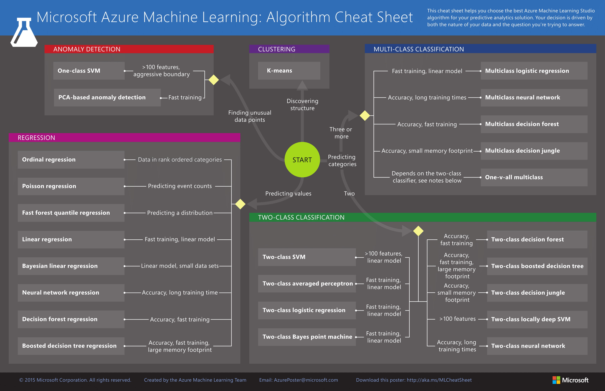

# Which Algorithm to Try

 [Rachel Thoma:](http://www.fast.ai/2018/07/16/auto-ml2/)

> a key benefit of random forests over gradient boosting machines \(GBMs\) is that random forests are more robust, whereas GBMs tend to be fairly sensitive to minor changes in hyperparameters. As a result, random forests are widely used in industry.

From Machine Learning Yearning:

> This diagram shows NNs doing better in the regime of small datasets. This effect is less consistent than the effect of NNs doing well in the regime of huge datasets. In the small data regime, depending on how the features are hand-engineered, traditional algorithms may or may not do better. For example, if you have 20 training examples, it might not matter much whether you use logistic regression or a neural network; the hand-engineering of features will have a bigger effect than the choice of algorithm. But if you have 1 million examples, I would favor the neural network.

* [What are the advantages of different classification algorithms? - Quora](https://www.quora.com/What-are-the-advantages-of-different-classification-algorithms)
* [Machine Learning Algorithms: Which One to Choose for Your Problem](https://blog.statsbot.co/machine-learning-algorithms-183cc73197c)
* [Adventures in AI Part 2: Which algorithm should I use?](https://fizzylogic.nl/2017/07/21/adventures-in-ai-part-2-which-algorithm-should-i-use/)
* [Which machine learning algorithm should I use? - Subconscious Musings](https://blogs.sas.com/content/subconsciousmusings/2017/04/12/machine-learning-algorithm-use/)
* [How to choose machine learning algorithms \| Microsoft Docs](https://docs.microsoft.com/en-us/azure/machine-learning/studio/algorithm-choice)
* [Start With Gradient Boosting, Results from Comparing 13 Algorithms on 165 Datasets](https://machinelearningmastery.com/start-with-gradient-boosting/)
* [Machine Learning Algorithms: Which One to Choose for Your Problem](https://blog.statsbot.co/machine-learning-algorithms-183cc73197c)
* [How to choose machine learning algorithms \| Microsoft Docs](https://docs.microsoft.com/en-us/azure/machine-learning/studio/algorithm-choice)
* [Modern Machine Learning Algorithms: Strengths and Weaknesses](https://elitedatascience.com/machine-learning-algorithms)
* [Machine Learning Algorithms: Which One to Choose for Your Problem](https://blog.statsbot.co/machine-learning-algorithms-183cc73197c)
* [When to Use MLP, CNN, and RNN Neural Networks](https://machinelearningmastery.com/when-to-use-mlp-cnn-and-rnn-neural-networks/)
* [When not to use deep learning](http://hyperparameter.space/blog/when-not-to-use-deep-learning/)
* [Selecting the best Machine Learning algorithm for your regression problem](https://towardsdatascience.com/selecting-the-best-machine-learning-algorithm-for-your-regression-problem-20c330bad4ef)
* [Pros and Cons of Neural Networks – Towards Data Science](https://towardsdatascience.com/hype-disadvantages-of-neural-networks-6af04904ba5b)
* [Anthony Goldbloom gives you the secret to winning Kaggle competitions \| Import.io](https://www.import.io/post/how-to-win-a-kaggle-competition/)

Advantage of Naive Bayes

> One of the major advantages that Naive Bayes has over other classification algorithms is its ability to handle an extremely large number of features. In our case, each word is treated as a feature and there are thousands of different words. Also, it performs well even with the presence of irrelevant features and is relatively unaffected by them. The other major advantage it has is its relative simplicity. Naive Bayes' works well right out of the box and tuning it's parameters is rarely ever necessary, except usually in cases where the distribution of the data is known. It rarely ever overfits the data. Another important advantage is that its model training and prediction times are very fast for the amount of data it can handle. All in all, Naive Bayes' really is a gem of an algorithm!

[Modern Machine Learning Algorithms: Strengths and Weaknesses](https://elitedatascience.com/machine-learning-algorithms)

Naive Bayes: extremely fast relative to other classification algorithms

 [A Tour of Machine Learning Algorithms](https://machinelearningmastery.com/a-tour-of-machine-learning-algorithms/)

* [Choosing the Right Machine Learning Algorithm – Hacker Noon](https://hackernoon.com/choosing-the-right-machine-learning-algorithm-68126944ce1f)

