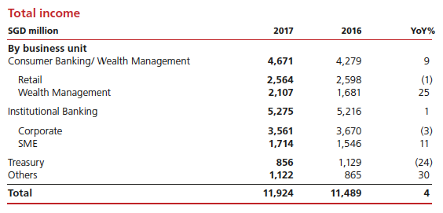

# Notes

## Potential Problems to Consider

Concept drift

## 

## Correlation

> It is important to discover and quantify the degree to which variables in your dataset are dependent upon each other. This knowledge can help you better prepare your data to meet the expectations of machine learning algorithms, such as linear regression, whose performance will degrade with the presence of these interdependencies.

> The performance of some algorithms can deteriorate if two or more variables are tightly related, called multicollinearity. An example is linear regression, where one of the offending correlated variables should be removed in order to improve the skill of the model.

Naive Bayes: extremely fast relative to other classification algorithms


{% embed data="{\"url\":\"http://www.r2d3.us/visual-intro-to-machine-learning-part-1/\",\"type\":\"link\",\"title\":\"A visual introduction to machine learning\",\"description\":\"What is machine learning? See how it works with our animated data visualization.\",\"icon\":{\"type\":\"icon\",\"url\":\"http://www.r2d3.us/static/app/global/r2d3-logo.png\",\"aspectRatio\":0},\"thumbnail\":{\"type\":\"thumbnail\",\"url\":\"http://www.r2d3.us/static/pages/decision-trees-part-1/preview-en.png\",\"width\":1120,\"height\":600,\"aspectRatio\":0.5357142857142857}}" %}


  
A very good introduction of t-SNE:  
[t-SNE](https://lvdmaaten.github.io/tsne/) is the very popular algorithm to extremely reduce the dimensionality of your data in order to visually present it. It is capable of mapping hundreds of dimensions to just 2 while preserving important data relationships, that is, when closer samples in the original space are closer in the reduced space. t-SNE works quite well for small and moderately sized real-world datasets and does not require much tuning of its hyperparameters. In other words, if you’ve got less than 100,000 points, you will apply that magic black box thing and get a beautiful scatter plot in return.  
Via [https://blog.sourced.tech/post/lapjv/?utm\_campaign=8ed002c926-Kaggle\_Newsletter\_04-11-2017&utm\_medium=email&utm\_source=Mailing+list&utm\_term=0\_f42f9df1e1-8ed002c926-400051409](https://blog.sourced.tech/post/lapjv/?utm_campaign=8ed002c926-Kaggle_Newsletter_04-11-2017&utm_medium=email&utm_source=Mailing+list&utm_term=0_f42f9df1e1-8ed002c926-400051409)  


training data is a set of observations that can be used to learn a function between inputs and outputs and constitutes the foundation of machine learning. Not all tasks can yet be captured in such a way.


Often, between the two, there is a trade off. Improvements may increase recall, but lower precision in the process, or vice versa. These are often combined into an F1 score, which is [a type of average that is biased toward the lower of two fractional values](https://en.wikipedia.org/wiki/F1_score). Systems often push for the highest possible F1 score.  
An acceptable F1 score depends on the application. There is no absolute number, though an F1 around 80% is typical for a useful system in many applications.  


  
Pandas is built on Numpy.  
In a simplified sense, you can think of series as a 1D labelled array.


## Callback

I am going to try to keep this dead simple. A "callback" is any function that is called by another function which takes the first function as a parameter. A lot of the time, a "callback" is a function that is called when _something_ happens. That _something_ can be called an "event" in programmer-speak.

Imagine this scenario: you are expecting a package in a couple of days. The package is a gift for your neighbor. Therefore, once you get the package, you want it brought over to the neighbors. You are out of town, and so you leave instructions for your spouse.

You could tell them to get the package and bring it to the neighbors. If your spouse was as stupid as a computer, they would sit at the door and wait for the package until it came \(NOT DOING ANYTHING ELSE\) and then once it came they would bring it over to the neighbors. But there's a better way. Tell your spouse that ONCE they receive the package, they should bring it over the neighbors. Then, they can go about life normally UNTIL they receive the package.

In our example, the receiving of the package is the "event" and the bringing it to the neighbors is the "callback". Your spouse "runs" your instructions to bring the package over only _when_ the package arrives. Much better!

This kind of thinking is obvious in daily life, but computers don't have the same kind of common sense. Consider how programmers normally write to a file:

```text
fileObject = open(file)
# now that we have WAITED for the file to open, we can write to it
fileObject.write("We are writing to the file.")
# now we can continue doing the other, totally unrelated things our program does
```

Here, we WAIT for the file to open, before we write to it. This "blocks" the flow of execution, and our program cannot do any of the other things it might need to do! What if we could do this instead:

```text
# we pass writeToFile (A CALLBACK FUNCTION!) to the open function
fileObject = open(file, writeToFile)
# execution continues flowing -- we don't wait for the file to be opened
# ONCE the file is opened we write to it, but while we wait WE CAN DO OTHER THINGS!
```

It turns out we do this with some languages and frameworks. It's pretty cool! Check out [Node.js](http://nodejs.org/) to get some real practice with this kind of thinking.


From [https://discussions.udacity.com/t/gridsearchcv-and-testingtraining-data/36107/4](https://discussions.udacity.com/t/gridsearchcv-and-testingtraining-data/36107/4)  
The error that you've provided is somewhat unrelated to the problems that you are having with GridSearchCV. Note the line upon which the error occurs:

```python
File "poi_id.py", line 244, in SVMAccuracyGridShuffle
feat_new=[feature_names[i]for i in pipe.named_steps['Select_Features'].get_support(indices=True)]
```

This is the third line of the code snippet posted. The error message notes that the pipeline needs to be fit to data first so that it can create the output attributes that you are trying to grab. If you are trying to get the names of the features selected by your parameter-selecting procedures, then you will need to do that after feature selection has been performed.In regards to the parameter selection and GridSearchCV questions, it's worth taking one more look at the overall process and the questions I posed at the end of my previous post. The image below might help give you another perspective that will help you understand the process visually:![](data:image/png;base64,iVBORw0KGgoAAAANSUhEUgAAAoAAAAHKBAMAAABhyOeHAAAABGdBTUEAALGPC/xhBQAAACBjSFJNAAB6JgAAgIQAAPoAAACA6AAAdTAAAOpgAAA6mAAAF3CculE8AAAAD1BMVEX///8AAACzs/+r/6vmioqoJgOUAAAAAWJLR0QAiAUdSAAAAAlwSFlzAAALEwAACxMBAJqcGAAAAAd0SU1FB98LCgAZKndqteEAABh3SURBVHja7Z1reuJKDoalHehLegOhewM5rKDnyf7XND90KZUxYCAJkP50Zhqwy+XyG9VN5ZJEKBQKhUK5UbT/sE/LFiYiYrpyk/NiBxmdTGZ3YwcAenVR9Py5GaBuxWbHb6LtbJVa76l+12vgvQA+jgY6QIWJCSAiYjARhagifsE/VCFqIoCIml8EmMJSKxQiJmJ+KQARDYAKiPgFUSMVEneMA4AoIAoRhZjoSGXiv70kgPm9YGIiojAxFYFV+eybAVo8qIkIHIapP5WIiglERU3ENM/6RRpPFkfFHKATcuW2aCA0/vN/IhMH0HPIbJyNWJL0DMwL5En8gJ8yz7zK9+1VWKuqmT9V/Iy/vbMTjeOaP0dzZMmrLu0Ao50IdrpstzQPjm7HtAoX3yxLou0WJlXc6cw9AAoGMmAABFAA4TVa/byG+m4EqIBo1GavmJCq3iLI2zlAOwQYJak/o//MqmGjfHcC6LcOAl0DpWlgVvLxbGobAR7W+bxj5utfTatdXGqgdIChkCJqQwPjL3EfgJ3VCYBdqapGql0DsNowaQ3eahUWyFGAfhcb5bsPQB2Po6IDoI5nr5bfehuYAKP91w4Q1Ykg+qJoK+IWJuNAANTVTsR7j2rpPAkOOpEq313awGqbBDYA5uhD29hDEdflMEbUBz+idamKAGMYo6KIC9THLnnHPOD5xhilDWNGxYxxSyRR6MEwBt8/jLl4YnX5kJpCgF8P0AiJQqE8rYCyXYwACfDxAHIUsr25I0ACJEACJEACJEACJEACJEACJEACJEACJEACJEACpBAgARIgAVIIkAAJkAApBEiABEiAFAIkQAIkQAoBEiAB/niAFG5zIMBnBkihUCgUCoVC+QdFF966jruAsSPzwu1Dy8OUepjCtpXmYabGJpcB1IOUWzC2NAtAzU2WpCO7cZVe9hf6fvWTbwIoRwEOJ46HGmgPr4HuFzHdc7ozMHX/Y+W3tKq5DZ+m7RsQvsBQrcEiu8gMEAtPqeEyDO55DRAZH+2+CjQHr/bAGpgeTsMjpDand61+WXNHV98m96mlpFN2KA+eGFVV1F2zrlVhG/dtDl4fGaCYmQ3fiOnw1Lp3xOY4VSZvsgW31cYpu2SgDfLw63gIUKX7nm0OXh8dIACZHJ7moaisxwHCO6Oy9czZrQF0j43rAMNzawP47Z5Rr9XAYmO9dpXDzmMAdfjvnDRQjgN0T5WrAGGtX5kcvD4ZQIF8IcByuHqkCi8APupQJsvafGSPSoNxSE90Imrh+TQ+DrKzUGZMbeBCzZedyLINfNBOBP2JJd26p8PTmmzArIYxUsOY8G5qlm5NYavZBSyEBmoOY9w1axzIj9T+cBjfHLz+I7Z0O6nuW5P+wzPrE2SNAD/TaEGAFArlMYYy/+C7BZ/6bgIBEuCdAb7snk7wur9aYCL49XG1EOCXAnzb7Xa73csTAXzfv+73+/z9eh+AwJOpIV73r/v9uwMscO+XaCBQFP/eroFvz1eFbwXYsH0OwBfsgN3b7gUvu5e3N+x2D6yWeN2/7/eve2D/vn/dA697YA+8+qF3bAP4F78+/uIXLqrRxwBit9vtXt522L3tXt5edi9vD9wWJsD9/vV9/zq+xv9fT7WFDeCvj78fvz5NAwPgy+7N4T0xwP2dAAJPBHD/+r7fAwUQuBwggI+/+DSAb0+lgfvX9/370MD36zTw4+Pj49eXAXx7aIDvrwPg+7UA/34mwEUV3uHl0QFGFd5775uf+80A/+LXB/DxcXsvfEQeGuDjz4UBzoVpTCBAAiRAAiRAAiRAAiRAAiRAAiRAAiRAAiRAAiRAAiRAAiRAAiRAAiTAnwCQb+lzmwMBPjNACoXyo10dXHyhrri2uNRBwBUeBnRjloorMj+x13Xhe00vBLYBoKYXk8UFs2822wLCTgK0frXdoisKALoNsn4DQLkE4CV3P6aBenNl020a6Jkh/KSJwlVS00GMweJD4Y7dAFFzp3bu3gqWzvAk8kBWFEvPWxDANBzOpJu8dG7XXd2JQtS95PnVmlnU3bNgdVLD6YyGjz1xlzTWi+ClNFGFAgL/5p75WnbNxZSWI8DzAN1ZULgHcndE6T0onBfBj4RTJvdUFLUEUtfZ7HjN0ndUVGFr3sq6c7vu6s7zgOS/3QWcdTdLBye7zyMdTvnQS6lxC3UnS+GZr2XX/GeqTKU72aCWi76qa+UCrwDr7CJrKLgNv1r9zHCV1QCOijs5dmq/JJ2A1r/VAOiK3624Mv+15rqve+saHr40HdhEUhvPGed0qsJ61ommu2CCmAILgApIVMmghnRFaSqp2+X+zqvUCYBq6wC7qzsB1gBm5vEH9YJNAP265rpvBWCUewmwZZdlaQDHkeOtZdegBtDy/k0Dx98sCZb3Nq8mchxgEFzRwAnsKsDIvDsumwBq00A7roGyBtAmDZQDDTzXBl4PcKocLY9jACdsFwKsu68AVLsfwNTi8oNq3TFq+KvLKtxcpepwKhhNckuA7ETsbCfS6OavCWDk1u8u3ZEeCqDa8LGHRXGlHkBHiRvAys7GkFVlKt2JgbSky97syHMoEv7q/CPHCpJDjbjUhz0w91CncVkOYwZAyWFMZODfvJTN1Z3AZoCR28hcpDvSSw3M6xTpui+HMdELx2ArtAwmvQ1sfvlgC4DXRex6JKevn1IWe8ZCf9Ic3QjwppJAnhEghUJ5ZluqrVnpcMKo9FlusvUpWy9bGj9XAdpkyLv0IfU6gHNZ9FhCeygNPApQbgAoPxZghfpII6MAZkCPAxJ2UGuRRi41UaqMeYigmV9xxhRrlmdl2HysQpl0M+udhvmTGdIqkoqFtbEbSFukkUtNlNqzkWF+7d9XTbGRTzdxWLNNWPe8fy+Ew2yhow0cD1TGEpvMrJeZKJtVo9t9lt8P7Tjd2lOT/2Ezknt72VfgHMCyg1o3s15ootTMJqphWUjb9xMAkW754UsyZSRsZtZ7dSBnNbDsoNathBda2NIgnabXspC27yc1sHcpWmZ23D3q1xaAvfG6AeCocc38KudMsWsAm43O7g8Q0WhrCwKyaAMXAHGxiXJ0Iml6HStpctoUW/nUSs2yExmp79MGphlyGBlhcxsIm9tAvdhE2YYxaXqtQQ7khCk2ypJTHV+kzsHUZGa994RFr9Bdyk1WSwK80RhAgBQKhUKhUCgUjqLPzOq2HbpslnjpOzt64W2/SVaskZcA1K3PrDdPvrduYvh+I8LXAZTPBfiQeqjxKmAtJtXL/VZBmnNtR9OUJH03QdXFiD7sti+YW7pyLa9vnhAxGHzjhMFiC4WIwGKjw3Srs5sY7AE0UNtyW1t7q0O1GtbeqO8W2AHQ4u1pHYtuwwBqZW4d78DmFgoRFVUbYaBttpoe38TwCAAzpvdkWde2E8OmQN19N0FVKFXV/t7v9JrzwZvX2kz3w87fX0xOLhs2MTwKwFxAq60C41CthpnMScaqtgP09bMTABGbJ04CzFsBtmUTw+No4KQnFf68NtzYWFsbL8MvNVDOaaCcB9j+WFs2MTwoQIHMAPva2hcDbHspNmxieACArT+otbfcKCetU6lOpO0mQO0aqR0M+cyxCNdX0TTbwLGeNnoylYNO5PwmhrsirN1TvnFhLB4ihjD1SoDNw5jaTaDQDlDRNdB3H+RmAR17Krz1lAmgxF6zeRhzfhPDD1hc2Lg7V4VyFtLBOF0I8MYmggApFMpjt1P0nUXnYwT41ADpwZIuQAmQAAmQAAmQAAmQjrj/lYE0ARLgzwH4T1qgCJAAfw5AtoEESIDPDfDlCWcTN5SZAAmQAAmQAAmQAAmQADmQJkACpEGV5iwCJEAaVNmJECAB3mUmcq/ZxE0zIAIkQAJ8eoCP8pY+ARIgAV4D8HOnNQTIzYY3VUECJMDnBkihULjln50IARLg3QA+4WzisWYiBEiABEiABEiABEiANKhyJkKABEiDKoVC+RqxKxKcch59TVTZ9aztiuew657VFh2IXZCBtaLb2okLAd7Ymusohx3c7RSkHpndjpTQdC0Q1EEMKjv6gOcAfoYGfgZAOQJwqwaeUKD1WFxLgGICE0N+KDwChYew8ThSHqZKIuaUYhEVSsTjpotYBF736OcVwGFKCo+1ogoFBP5NIRkKq6KvVy2v4CYZ2coDQpgKYKZaJRMBLB9Ftf7NimYRVyKC5IhCFBlfPoPAwx/ac9cp5JbfEFgAVNEMHRIBojxCvZhmkK6Kb+NnbI4KlSHtpUJ9tH81b4+exHOOIFMm6lFCoiQVhEpGdJEIcSKZ1KQFvRrRsLSioHgwrAqJ1Z5D88qWuUbcl5bjHG5mHJrjiI2gU1KBbBKPZmNRMVYsDy1Dypg2hV6mEZmSysjGRsibXpI4V1eOkGJSSRtAyZJJDzAzjo/ANxmjzFppRmaLgD1zgxfxelQWUXRckT1MFJDU4FHlAKugMh5MKg8dAIwK5y0CPPCZp10FGNksAUZJTH1+1AHCTx0HCAyAChwAzDBbca5KugAYIdsSoNoZgKVbMsLwmHbdTIJds1YACqSpV9RUOa6BsgbQJg2UWQPlnAaORt5OaKANDdQVDYySJ8AieCPADCZ1AuBUP1vaTwBYLe2tAKMjPA1wXLkSNe8IQIRGZ3yjEe9JZWp8W/jClqpRkwpEZaObkSnp6Gcq30EFGSYpy2+h3XrQBuoAWGWpB5yrcHaGDhAjXJbaHKRRWo46gmhJtZarABUeZwupgREXyiNaSg1jbJyZo0KNYYzvAjL/6Wl1DEa8F46RTmgZTHobmHUBGQwnw3G28FmR1DLolcfXrPic+SgNoB+NBi7OwSyeQlspfBgDZEgthU0APae7mnM+/eb66bfVa27wowHqZRD0i0v8hBp4mQ2VwbMolH9SbjRvrrYdNxusbCqcbsrzXCB22/wAl7WGNzfvetJ4pqcLamu2SVuYarcCtI7Rrgd4GZP7Aly7v8qVAE/r4QUAz6rgFeZNNHspTtpO0/pYtk6JyLdIy2jcw+Azitm02axckoUr2yhMfa7UQunmLCqNLuK3mky/2h/K54wV8ncUSct4fHaAdLF5czlZPGE7TTOA9fjWNbuseShaFW6mTZnCB7cpawZztmUwZ22FndJ30297qEg9Ct6mxmO6frbaXmDeXDHIyAnbqU7mmWFGaQHDZYp3fWAX6aZak8kQWuHEbTxm2JG0leaI3SiMDBHVfDbDdFPCNoCbzZtZDdNe2r+fAFi2TvhCSwOYxtzjAGNF4zjAOZ69AAXQbagzQNfbNYD5DAUQsM0auN06F6ZTlPXxhO1UJx0qa7tNIevPaGBf1FkH2AhWq3Iinr3aOkBd0UD5GoDLVZCjttN1gC1k/QaA56vw+H/8bU4D7Dc5DlBtM8BLzJtpKx2ttZyynWp1A9at8wOg5T3mTqQYr3Yimp2ILDsRf2yNTgRitUo423OtldIGQLVhQc0e6izAC82baSutwU37fmg7Tetj2TolRxzIYU/c49C0qfMwZhQubKOxuDUNY3xkZebDGM0MJ9OvxpqyF6oBLNusxMjOM/9249In2/HuPr19boD3t2XakwPUR1dACoVCoVAoFArlxKDabh2B9wHp2uLf8744YNLetLscoF3xzMde/9etJT6Sma2l1K+ebFn+70cC/AZtVYkXL9v7+9PGgrDx9SU46XsEqkaGJc+Xvtqynhvb6jU/GYt/tdrnJn+4uUt8qdB3NSjmjQ4iCmjuupDcjFEv9dU+C19l1MWinH0hwPEirc4bC+Jd9rYEJ8vXWBtAzYUH1M9407hes6/Fv1xAG5lqe8/bas9FK4+Utbh+tT0L0vZZWKvCtSj3xQCtv6Y7LOwi0/aGUfGzRLlqYWZ9fTFXxQpOW/csu70dLACIHLywPcqTVVinX23nVt9nsW7R//RG0MTml38R+wFiY4GXpy3BifQ9AmO3nZnZ2JxgtSpWAAEcAGw3mQBi7LnoGx0GwPEri2a9ZPcEOKqxLPbRFEGbd+NMGigyrUpNGigrGihHNFAONVAmDZy6FEiv0nJ3gG1jwcES3GUAJd+quglg21+1DrA1J98MUEfrXQ+ifWNBNnY2dSJ9j0C9Pl/dQFvWK4A2ltqizc2+qRba2mJc9T82bXQYAKd1O20Aa5/F3InYF3UiY3V1vL+fgwT0tUDMw5jaIyCwDlDaWz6xKpbDjVzZq/W1Wu2rhbaRokZANm10kFj807YLQtvKYO2z0Ew5Lco9rLcJu/Lc95bkcUWFAO8DlwApFMojCCi3ed4iFQK8M8CX3/v9f+7f8fd++Hrs33eZIH7t9wvHkPP59Tx2u9/7KWH7/nv/e5llP32Q/WHqfmz/3+9TBfy9H2n3/+3OPvzvfT4wARIgARIgARIgARLgjwJI4UyEAOnGm0KhUGiRZi9MIcA7WKR9SjNNrFanUGPKtzKd+r0/ct3aLG8xp2s5Hczpjk6wFlPBI5OwlWneqXSL4k5Udr/3BEiABEiABEiABEiAPwoghTMRAqRFmkKh0KDKToQAKdcaVMcofB7u7/87PmiPH6vvxSxzWXuZ5fCdm/9Wj5+ejIw3V1bnMitv2Pjn8gWfg6KslIYACZAACZAACZAACfBHAaRwJkKANKhSKBQKhSZ9CocxBPh0AH997Ha7Px8+28vP+etu9/G/3eqJPx/93J+P+arFhWsZLy9ZpF/cdzr78b/2079Oh9qdFtdNSZaPszt4hhICJEACJEACJEACJMAfBZDCmQgB0qRPoVBoUGUnQoCUa9+RbkP4j//tFrOLw7nBkcnEIu2fj8W8ok87plnC+vzhyJQkv8bn8YnRidnQ4U2OToFangRIgARIgARIgARIgD8KIIUzEQKkQZVCoVBokWYvTCHAO73iu/4GysfHx8r0p096Ts+S6lWTg4nT8sBKGj908t2aY2/yRMlWXug5+V7O4c3agT8fJ18uIkACJEACJEACJEACfD6AFM5ECJAWaQqFch9RqXqtiCPz+U1iR3/ZqYTrd9Cveb6LZNtVmG5g/s8aQD33bDads5b8GMAjWdpBCU7BuQKgbcvYtv51LgQoXw1QnhQgTBQQUUAVJhLVGRCBCWACh6TxmV8hIt6/VyIxmLcIgBngOXlaE/Vzfo1C1K9UiBjMsgQG8zYlM1NFfkRegIlf5YWKW6Yim+j8fBZPlG1VpAZE1Mb3UWy1c2qjcQMt6HFXHfro//k/wTwAZkItDfREAj9kogFt3MvE/JxmjdVM7DSyBBA1sZaZWn5g3FfzKq3c4naWeefzVRqxfDhTGcWp71LFNt0KsOeqC0yFRVuNUKkr1a9Oxc/sdPxZ4pCnjXJW/TMdya2wt79LZqCZPO4Zudft67SIiKomEpursuVTSSvIolBaj2DXAgQwKipEozaLhlprfgWwCWClVaCVFdgGMC7yD4sCat0+6lrU6QKYufsz2AJgpvaWq743gGemHoq6wYoGylxRm05Wdc1KtgVgpW1/dBk6cgagZoqmgdISVKGy9U4NbPUkCNqoV5ka+ddMgkMDz3ZiVwCcK/dmgJn2awA2JH5qBWC2gXqQOlGZTE+iW4YeK52IZL8hYgKxbMYxdyJoXYzOnYi1TsR6J6LZukfpVNTiev9vFaBGuvxYdG02AKmN54g+J/LAQSeSqbMLmzsRy45oG0BB1TT4Hwj1S6EiMIW2YYwAOYwxEVhmkidjGONnrIYxJj5eUcQdYKaeShGljhIUQMQdtJJbFtBvaFKFMouBiMTh1FVUwbWGMZkamIc0o9iR8BnEbp1U/ePzcRUCvOkNMSNACoVy75a8zyWXc5ZrrEu6KaFttlHZY7eOpwBuK6lt5TSfWPTBFwDUnwVQ5VoNvBbgvVWwTJOWllMHiGbHNFGFAgL/Ni6xGsA3M25MDcI0K3GVwMK0oXkrEbhtVEwFZRH1g36DmPrV3GCYadPOeHeAaZrUbu+sGVRM3dXGdLRfgppClqHN11jqVE2TUVN661YJU2sG1XZQ23+QmqxjWF5jCqx3r7Rpj9Rm3x+WiTJ+2khUj2p1rl0g/ZQOq2RkPIwqzaw9DBnd1i0mZmYLY46V/aDbRR8FYBgnBQNg2DGXADWsqG7jRAfYTi0BWlg40+zfAaZF9BjAKVsV89s+nAbGXxtNA2UNoE0aKB2gHdVAnSyJ0UYkwEFwHaAdaqA8LsBux/w8gLYAmGnaiovMltVjALNhfBCAmubS0TJbM4pqs4YOgCiLYzO+xvJFnpp6KMtls7LMzuthfW2nrwMWQAwzbXZWDwIwhjEa9s62NprLtpLjitEGVqOWZxJ8O6V5zgHm4q9bZgXwAY2FubaGMWXPndakoN1M203AT2ji3DiQ/oIrnsnSZY+I/JGncrcD1O8GQFMrhUKhUJ5S/g8onhYyyvnKwwAAACV0RVh0ZGF0ZTpjcmVhdGUAMjAxNS0xMS0xMFQwMDoyNTo0MiswMDowMKlDtQQAAAAldEVYdGRhdGU6bW9kaWZ5ADIwMTUtMTEtMTBUMDA6MjU6NDIrMDA6MDDYHg24AAAAAElFTkSuQmCC)  
GridSearchCV will be applied to the entire part of the data that you hold out for training \(and validation\). Once we have our algorithm and parameters selected, we no longer use GridSearchCV, and assess model performance on the part\(s\) of the data that we use for testing, fitting our selected algorithm on the remainder of the data.


Let's start with the code snippet:

```python
clf_cv = GridSearchCV(clf, ... )
clf_cv.fit(features_train, labels_train)
test_predict = clf_cv.predict(features_test)
f1_test = f1_score(labels_test, test_predict)
```

This corresponds with the following diagram:![](data:image/png;base64,iVBORw0KGgoAAAANSUhEUgAAAoAAAACLCAMAAADGS9j7AAAABGdBTUEAALGPC/xhBQAAACBjSFJNAAB6JgAAgIQAAPoAAACA6AAAdTAAAOpgAAA6mAAAF3CculE8AAABhlBMVEX///8AAADd3d27u7tAQEBhYWGkpKRSUlKLi4u2travr68vLy+1tbWampqUlJQoKCiZmZmioqLNzc3IyMjHx8fS0tKsrKyPj48dHR0NDQ1jY2NYWFgMDAwXFxeXl5cYGBgTExOJiYmtra2pqamoqKiysrKRkZE8PDwJCQklJSWcnJx4eHgeHh4FBQUbGxt5eXlkZGROTk5UVFQqKipmZmYWFhbJyckwMDC0tLTKyspoaGhRUVHLy8shISFVVVUfHx9CQkJHR0cjIyNWVlaqqqpDQ0NtbW2FhYUtLS2KioqIiIgaGhplZWUICAjW1ta4uLi6urpBQUEODg4BAQHOzs7Y2NgCAgIHBweHh4cpKSldXV2enp4mJibQ0NDZ2dknJyfX19cEBASGhoYgICCwsLCnp6dKSkqxsbFNTU0PDw/BwcE/Pz+WlpaYmJiEhISjo6NJSUm3t7ebm5tPT0+QkJCBgYF9fX2CgoJ1dXVqampubm4LCwt8fHwiIiKOjo6zs/+r/6vmiopT9k5jAAAAAWJLR0QB/wIt3gAAAAlwSFlzAAALEwAACxMBAJqcGAAAAAd0SU1FB98LEBU0BzfWZRsAAAOYSURBVHja7d3nU9NwHMBh07gQVByICCqiqDhRQXGh4lYcgIqIE0FF3AP3+s+llUt7Huf5om1K8nxe1Ouvb+I3z9GQtGHOHEmSJEkqf4GSXqXtdwABBFAARhuSUXL7B8AwjgAEEEABCCCAAApAAAGcPQDn2p8AlgfgvPl2XRoBLlj4v4tFB1gVLCrY7Ooauy4dABcHSwp4LK2dwcyMi0UGuGz5imBl3aqCrc6uBvWrG9ZM/dvYtHZdbjH3Wu365lo7NhkAN7RsDDa1bi7QkV1t2bK1bVsYbt+xc9fuaLG0ANvb9gR793VEm925P7fxB7oOHso9b92Ve557OHxk81E7NhkAu48dD070nIx4NJ/KPp4+U3P2XBg2nK+6cCJaLPVbcPvF3oLNvnQ5t/FXck+u9vUHA3mA1zLXb9ixSXkL7u7sLuAxWJN97J96cTAMb1YP3WqJFksMcPj2naHh/GYP3I3AZTL3NtTdf5AHmH9Bsx7gyMPRnpE8j4Er2ceGsemnox1Ho8USA3z0ONP1JL/Z49uenoycjY/d6Q0ATCTAiWfh8748j4YXL1+F4fHG12/mhuHbd6/fd0aL5T0NM9l/8UPkrL55/ccbf34zCQBM9GmYT02dn6d+CZn40vw1DCe/DfZ8jxbLAnD6A1t2W8oATu93l+IU809AAAWgAARQAApAAAWgAARQAApAAAWgAARQAApAAAWgAARQAApAAAWgAARQAArA/wMod8n3ZxoEoACMbXsklelv4xmCGRqeGRqezNDwzNDwZIaGZ4aGJzM0PDM0PJmh4Zmh4ckMDc8MDU9maHhmaHgywyKMzkciAYxboDEAaHhmmNbpGQGAAvCvw3Kl7FtxAApAAAGsBIA/VPqm5vwzjgAUgAACCCCACQFY5CNLAAGM9XImgAB6CwZwVgEs6uVMAAGM//NJcoNKd0gVgALQLXpVpkOvX3EEoAAUgI4BHQMCKAABBDB2gK5IlOeKRFz/XwABBBBAAAEEEEAAAQQQQAABBBBAAAF0ItqJaABVVoABgIoVYODjWIr3ez8AKt4vngEoPwEdAzoGBFB+C5bzgOm7EpK2KxIxXvkBEEAAAQQQQAABBBBAAAEEEEAAAQQQQCeinYgGUAAKQB/HkhtUCkAA5Q6pSv4xYGVsj/0DIIBKNUBXJFJ4JaSSDkYBBBBAAQgggAAKQAABBFAAAghgLHdOUgpORAMoAAEEUJIkSZJS0m84cBGnoVgEsQAAACV0RVh0ZGF0ZTpjcmVhdGUAMjAxNS0xMS0xNlQyMTo1MjowNyswMDowMNu/7m8AAAAldEVYdGRhdGU6bW9kaWZ5ADIwMTUtMTEtMTZUMjE6NTI6MDcrMDA6MDCq4lbTAAAAAElFTkSuQmCC)  
Given training and test partitions \(upper half\), we first use cross-validation to find the best-fitting parameters using the training partition \(lower-left, demonstrated as 4-fold CV\), then assess the model's performance on the test partition \(lower-right\). This, taken on its own, does not seem to have any issues, but the question to think about at this point is how the \*\_train and \*\_test partitions were generated and how they are relevant to the data we have available.Have we performed a single split into training and test partitions? Do we have multiple partitions? If we have multiple splits, is there a way that we are assessing overall performance? How much information are we getting from performing a split into training and test partitions, considering how much data we have available? Is there a different way in which we should be performing our algorithm fitting and performance assessment?![](data:image/png;base64,iVBORw0KGgoAAAANSUhEUgAAAoAAAAB6CAAAAAAKML2pAAAABGdBTUEAALGPC/xhBQAAACBjSFJNAAB6JgAAgIQAAPoAAACA6AAAdTAAAOpgAAA6mAAAF3CculE8AAAACXBIWXMAAAsTAAALEwEAmpwYAAAAB3RJTUUH3wsQFhYkMEXsEAAAAAJiS0dEAP+Hj8y/AAACOElEQVR42u3dLU4DYRCA4Q9Z14OgkBVUcAJOxgkw7TF6BNIj1OFxKJKikLthf5L9ZuZ5LYYMTzPNwJZ2lzasGYEAFIASgKoLsGlCQ9PU1CECCGAvAK2Df6+NNvULGpoVgAACCCCAZgcggAACKAABBBBAAQgggAAKQAABBFAAAggggAIQQAABNDsAAQQQQAABBBDAFADlmRAPJQFYFaC0ySbu/H2CF0jyKQIIIIAAAtjx6D4Ou6crRkmnGADg6/n7/RGjpFOMsYI/9xglnWIIgF/PbxglnWIIgMcTRVmnGALgww9FWafoDFPnPeAdwJmje4Eo7RQBBBBAK9gKNjoAAQQQwM4G1xBMPsXW/ewQSj1FK9gKBjDstxdFoO9NGgNY84ms9R+M86TbzKfiAARwY4C3Uv0BvMxuCGC1OS6eIIAAAggggAACCCCAAAIIIIAAAggggAAGBCiHaAABrApQs/8YAUAAAbSCrWAAAQTQGSbMKWXpzwBAAAEEEEAAAQQQwMIAPROyzjMhAAIIYDyAWuszCAAEcOuPYZH/lgkggJLPhhGAVrCsYAABdIZJeEpZ/tsoAAEEEEAABSCAAAIoAAEEEEABCKBDtEO0AARQmV+zRiAArWArWAACWPkME/GU4gwDIIACEEAAARSAAAIIIIAAAggggA7RcogGEEBp7DVrBALQCraCBSCA8QHWOqU4wwAIoAAEEEAABSCAAAIIIIAAAgigQ7QcogEEUBp7zRqBABSAEoAq1y/CDo6dSHGt9AAAACV0RVh0ZGF0ZTpjcmVhdGUAMjAxNS0xMS0xNlQyMjoyMjozNiswMDowMGe2m3UAAAAldEVYdGRhdGU6bW9kaWZ5ADIwMTUtMTEtMTZUMjI6MjI6MzYrMDA6MDAW6yPJAAAAAElFTkSuQmCC)  
Hopefully it's easier to see from here how the choice of what we do outside of the core snippet above has an impact on how the overall procedure looks. For more specific concerns regarding the way our model-fitting and assessment approach interacts with the data in the project, it'll probably be best to move the conversation back to the [more relevant topic](https://discussions.udacity.com/t/p5-testing-results-all-over-the-place/37850/).


According to Wiki, Cross-validation, sometimes called rotation estimation,[\[1\]](https://en.m.wikipedia.org/wiki/%23cite_note-1)[\[2\]](https://en.m.wikipedia.org/wiki/%23cite_note-Kohavi95-2)[\[3\]](https://en.m.wikipedia.org/wiki/%23cite_note-Devijver82-3) is a [model validation](https://en.m.wikipedia.org/wiki/Model_validation) technique for assessing how the results of a [statistical](https://en.m.wikipedia.org/wiki/Statistics) analysis will generalize to an independent data set.  
Suppose we have a [model](https://en.m.wikipedia.org/wiki/Statistical_model) with one or more unknown [parameters](https://en.m.wikipedia.org/wiki/Parameters), and a data set to which the model can be fit \(the training data set\). The fitting process [optimizes](https://en.m.wikipedia.org/wiki/Optimization_%28mathematics%29) the model parameters to make the model fit the training data as well as possible. If we then take an [independent](https://en.m.wikipedia.org/wiki/Independence_%28probability_theory%29) sample of validation data from the same [population](https://en.m.wikipedia.org/wiki/Statistical_population) as the training data, it will generally turn out that the model does not fit the validation data as well as it fits the training data. This is called [overfitting](https://en.m.wikipedia.org/wiki/Overfitting), and is particularly likely to happen when the size of the training data set is small, or when the number of parameters in the model is large. Cross-validation is a way to predict the fit of a model to a hypothetical validation set when an explicit validation set is not available.  
There are a couple of common types of cross-validation and the most common one is k-fold cross-validation[Edit](https://en.m.wikipedia.org/w/index.php?title=Cross-validation_%28statistics%29&action=edit&section=7)In k-fold cross-validation, the original sample is randomly partitioned into k equal sized subsamples. Of the k subsamples, a single subsample is retained as the validation data for testing the model, and the remaining k − 1 subsamples are used as training data. The cross-validation process is then repeated k times \(the folds\), with each of the k subsamples used exactly once as the validation data. The k results from the folds can then be averaged to produce a single estimation. The advantage of this method over repeated random sub-sampling \(see below\) is that all observations are used for both training and validation, and each observation is used for validation exactly once. 10-fold cross-validation is commonly used,[\[6\]](https://en.m.wikipedia.org/wiki/%23cite_note-McLachlan-6) but in general k remains an unfixed parameter.  


Root Mean Squared Error \(RMSE\)The square root of the mean/average of the square of all of the error.  
The use of RMSE is very common and it makes an excellent general purpose error metric for numerical predictions.  
Compared to the similar Mean Absolute Error, RMSE amplifies and severely punishes large errors.  
[https://www.kaggle.com/wiki/RootMeanSquaredError](https://www.kaggle.com/wiki/RootMeanSquaredError)  
from sklearn.metrics import mean\_squared\_errorRMSE = mean\_squared\_error\(y, y\_pred\)\*\*0.5  


You may ask why should I care about gradient boosting when machine learning seems to be all about deep learning? The answer is that it works very well for structured data.XGBoost has become so successful with the Kaggle data science community, to the point of [“winning practically every competition in the structured data category”](https://www.import.io/post/how-to-win-a-kaggle-competition/).

Essential to these successes is the use of “LSTMs,” a very special kind of recurrent neural network which works, for many tasks, much much better than the standard version. Almost all exciting results based on recurrent neural networks are achieved with them. It’s these LSTMs that this essay will explore.

Since computation graph in PyTorch is defined at runtime you can use tour favorite Python debugging tools such as pdb, ipdb, PyCharm debugger or old trusty print statements.

In practice regular RNNs are rarely used anymore, while GRUs and LSTMs dominate the field.

By the way, one of the absolute best books I’ve read on this topic \(and neural nets/deep learning in general\) is the just released [Hands-On Machine Learning with Scikit-Learn and Tensorflow](http://amzn.to/2p5t4Ll). I saw a few earlier editions and they really upped my game. Don’t wait, just grab it ASAP. It rocks. It goes into a ton more detail than I have here but I’ll give you the basics to get you moving in the right direction fast.

Batch Normalization helps your network learn faster by “smoothing” the values at various stages in the stack. Exactly why this works is seemingly not well-understood yet, but it has the effect of helping your network converge much faster, meaning it achieves higher accuracy with less training, or higher accuracy after the same amount of training, often dramatically so.


Precision is the percentage of relevant items out of those that have been returned, while recall is the percentage of relevant items that have been returned out of the overall number of relevant items. Hence, it is easy to artificially increase recall to 100% by always returning all the items in the database, but this would mean settling for near-zero precision. Similarly, one can increase precision by always returning a single item that the algorithm is very confident about, but this means that recall would suffer. Ultimately, the best balance between precision and recall depends on the application.


A word embedding is an approach to provide a dense vector representation of words that capture something about their meaning.

Word embeddings are an improvement over simpler bag-of-word model word encoding schemes like word counts and frequencies that result in large and sparse vectors \(mostly 0 values\) that describe documents but not the meaning of the words.

Word embeddings work by using an algorithm to train a set of fixed-length dense and continuous-valued vectors based on a large corpus of text. Each word is represented by a point in the embedding space and these points are learned and moved around based on the words that surround the target word.

It is defining a word by the company that it keeps that allows the word embedding to learn something about the meaning of words. The vector space representation of the words provides a projection where words with similar meanings are locally clustered within the space.

The use of word embeddings over other text representations is one of the key methods that has led to breakthrough performance with deep neural networks on problems like machine translation.


Word2vec is one algorithm for learning a word embedding from a text corpus.

There are two main training algorithms that can be used to learn the embedding from text; they are continuous bag of words \(CBOW\) and skip grams.

We will not get into the algorithms other than to say that they generally look at a window of words for each target word to provide context and in turn meaning for words. The approach was developed by Tomas Mikolov, formerly at Google and currently at Facebook.


"If you are looking for a career where your services will be in high demand, you should find something where you provide a scarce, complementary service to something that is getting ubiquitous and cheap. So what’s getting ubiquitous and cheap? Data. And what is complementary to data? Analysis"— Hal Varian, UC Berkeley, Chief Economist at Google


A random forest is a bunch of independent decision trees each contributing a “vote” to an prediction. E.g. if there are 50 trees, and 32 say “rainy” and 18 say “sunny”, then the score for “rainy” is 32/50, or 64,% and the score for a “sunny” is 18/50, or 36%. Since 64% &gt; 36%, the forest has voted that they think it will rain.  
  
When you add more decision trees to a random forest, they decide what they think INDEPENDENTLY of all the other trees. They learn on their own, and when it comes time to make a prediction, they all just throw their own uninfluenced opinion into the pot.  
  
A gradient boosting model is a CHAIN of decision trees that also each make a vote. But instead of each learning in isolation, when you add a new one to the chain, it tries to improve a bit on what the rest of the chain already thinks. So, a new tree’s decision IS influenced by all the trees that have already voiced an opinion.  
  
Unlike a Random Forest, when you add a new tree to a GBM, it gets to see what its predecessors thought - and how they got it right or wrong. They then formulate a suggestion to correct the errors of their predecessors - and then they add that to the pot, and then the process continues with the next tree you add to the chain.


Gradient boosting  
Gradient boosting is a type of boosting. It relies on the intuition that the best possible next model, when combined with previous models, minimizes the overall prediction error. The key idea is to set the target outcomes for this next model in order to minimize the error. How are the targets calculated? The target outcome for each case in the data depends on how much changing that case’s prediction impacts the overall prediction error:  
  
If a small change in the prediction for a case causes a large drop in error, then next target outcome of the case is a high value. Predictions from the new model that are close to its targets will reduce the error.  
If a small change in the prediction for a case causes no change in error, then next target outcome of the case is zero. Changing this prediction does not decrease the error.  
The name gradient boosting arises because target outcomes for each case are set based on the gradient of the error with respect to the prediction. Each new model takes a step in the direction that minimizes prediction error, in the space of possible predictions for each training case.


Ensembles and boosting  
Machine learning models can be fitted to data individually, or combined in an ensemble. An ensemble is a combination of simple individual models that together create a more powerful new model.  
  
Boosting is a method for creating an ensemble. It starts by fitting an initial model \(e.g. a tree or linear regression\) to the data. Then a second model is built that focuses on accurately predicting the cases where the first model performs poorly. The combination of these two models is expected to be better than either model alone. Repeat the process many times. Each successive model attempts to correct for the shortcomings of the combined boosted ensemble of all previous models.


## Data Science for Business

### 1. Introduction: Data-Analytic Thinking

### 2. Business Problems and Data Science Solutions

### 3. Introduction to Predictive Modeling: From Coorelation to Supervised Segmentation

### 4. Fitting a Model to Data

### 5. Overfitting and Its Avoidance

### 6. Similiarity, Neighbors, and Clusters

### 7. Decision Analytic Thinkings I: What Is a Good Model?

### 8. Visualizing Model Performance

Common visualizations:

1. ROC curve
2. Cumulative response curve: tp rate \(tp divided by totally number of positives\) \(y axis\) vs. percentage of the population that is targeted \(x axis\)
3. Lift curve

> One of the reaons accuracy is a poor metric is that it is misleading when daasets are skews…

\(e.g. 93% negatives and 7% positives.\) AUC is a better metric.

> Even modest AUC scores may lead to good business results.

> A critical part of the data scientist's job is aranging for proper evaluation of models and conveying this information to stakeholders. Doing this well takes expereince, but it is vital in order to reduce superises and to manage expectations among all concerned. Visualizatino of reults is an important piece of the evaluation task.
>
> When building a model from data, adjusting the training samplein various ways may be useful or even necessary; but evluation should use a sample reflecting the original, realistic population so that the resutls reflect waht will actually be achieved.
>
> When the costs and benefits of decisions can be specified, the data scientist can calculate an expected cost per instance for each modeland simply choose whicever model produces the best value. In some cases a basic profit graph can be useful to compare modesl of interest under a range of conditions. These graphs may be easy to comprehend for stakeholders who are not data scientists, since they reduce model performance to their basic "bottom line" cost or profit.
>
> The disavantage of a profit graph is that it requires that operating conditions be known and specified exactly. With many real-world problems, the operating conditions are imprecise or change over time, and the data scientist must contend with uncertainty. In such cases other graphs may be more useful. When costs and benefits cannot be specified with confidence, but the class mix will likely not change, a _cumulative response_ or _lift_ graph is useful. Both show the relative advantages of classifiers, independent of the value \(monetary or otherwise\) of the advantages.
>
> Finally, ROC curves are a valuable visualization tool for the data scientist. Though they take some practive to interpret readily, they seperate out performance from operating conditions. In doing so they convey the fundametal trade-offs that each model is making.


Basic flow per the readings so far:

Step1: Exploratory Data Analysis

Step2: Data Preprocessing

Step 3: Feature Engineering

Step 4: Model Selection and Training

Step 5: Model Ensemble

Some tips

设置random seed，使得你的模型reproduce，以Random Foreset举例：

seed=0clf=RandomForestClassifier\(random\_state=seed\)

每个project组织好文件层次和布局，既方便与其他人交流，也方便自己。比如在一个project下，分设3个文件夹，一个是input，放训练数据、测试数据，一个model，放模型文件，最后一个submission文件，放你生成要提交的结果文件。具体的可以参考[这里](https://www.kaggle.com/wiki/ModelSubmissionBestPractices)

From [http://www.jianshu.com/p/32def2294ae6](http://www.jianshu.com/p/32def2294ae6)


## Data Science Notes

### Machine Learning Process



Unsupervised learning and supervised learning can be used together. 


### Metric

#### F1

> My identifier has a really great F1. This is the best of both worlds. Both my false positive and false negative rates are low, which means that I can identify POI's reliable and accurately. If my identifier finds a POI then the person is almost certainly a POI, and if the identifier does not flag someone, then they are almost certainly not a POI.

#### Precision and Recall

> My identifier doesn't have great **precision**, but it does have good **recall**. That means that, nearly every time a POI shows up in my test set, I am able to identify him or her. The cost of this is that I sometime get some false positives, where non-POIs get flagged.
>
> My identifier doesn't have great **recall**, but it does have good **precision**. That means that whenever a POI gets flagged in my test set, I know with a lot of confidence that it's very likely to be a real POI and not a false alarm. On the other hand, the price I pay for this is that I sometimes miss real POIs, since I'm effectively reluctant to pull the trigger on edge cases.

### kNN

#### Disadvantage

Linear regression can extrapolate the ends but kNN can't:


## Quora Kaggle Competition

Questions

* For data balancing, normally the objective is to make the ratio of positive and negative classes be 50/50. But in the [kernel by anokas](https://www.kaggle.com/anokas/data-analysis-xgboost-starter-0-35460-lb) he made the ratio of the training set from 37% to 17%, which is the ratio of the test set. There is a [relevant discussion thread](https://www.kaggle.com/c/quora-question-pairs/discussion/31179) initiated by sweezjeezy.
* According to [YantingCao](https://www.kaggle.com/anokas/data-analysis-xgboost-starter-0-35460-lb#181191), the re-sampling approach in the [kernel by anokas](https://www.kaggle.com/anokas/data-analysis-xgboost-starter-0-35460-lb) leak information into the cross validation set. In other words, the cross validation set contains data from the training set. anokas also agreed on this. My questions are:
  * What does 're-sampling' mean?
  * Why such approach lead to such issue?

Notes

Since our metric is log loss, resampling the data to represent the same distribution \(of 0.165\) will give us a much better score in Public LB. The ratio of the training set can be observed directly. The ratio of the test set can be calculated using the result of a [naive submission which use the ratio of the training set as the estimated probability](https://www.kaggle.io/svf/1077333/f8eecce4cf447dccad546c8ec882e0d1/__results__.html#Test-Submission) and [a bit of magic algebra](https://www.kaggle.com/davidthaler/quora-question-pairs/how-many-1-s-are-in-the-public-lb) as there is only one distribution of classes that could have produced this score. It seems from the discussion that such method is only applicable to evaluation with logloss function.

Suggested by [Paul Larmuseau](https://www.kaggle.com/anokas/data-analysis-xgboost-starter-0-35460-lb#179520):

> I wonder you could beat your splendid results if you correct one error... since you use .lower\(\).split\(\) you don't split the '?' from the last word, i presume since i discover that one of your least frequent words has a '?' fulfill?'. So i would 'clean' the data with a replace '?' with ' ' or i prefer to use nltk.word\_tokenize\(q1\) , so doing this you would split all words from the punctuations, and make disappear one type of error, as in that case you throw away nearly all last words of all questions as 'rare' words, or you cluster together all questions with the same last word. Since i didnot install yet that wonderfull XGaboost, i give you the honour to improve or worsen \(i don't know yet\) your own results.

According to [Philipp Schmidt](https://www.kaggle.io/svf/1082541/22b67ba5fac3793c4b56697f1d0906e8/__results__.html#Feature-construction), to limit the computational complexity and storage requirements we can subsample the training set by `dfs = df[0:2500]`. After subsampling we should check if the distribution of the positive and negative classes of the subsample is similar to the original training set. If not we need to find out a better sampling method.

#### Text Analysis using Machine Learning

Most of the algorithms accept only numerical feature vectors \(`vector` is a one dimensional `array` in computer science\). So we need to convert the text documents into numerical features vectors with a fixed size in order to make use of the machining learning algorithms for text analysis.

This can be done by the following steps:

1. Assign each of the words in the text documents an integer ID. Each of the words is called a `token`. This step is called `tokenization`.
2. Count the occurrences of tokens in each document. This step is called `counting`. The count of each token is created as a feature.
3. `Normalization` \(**Don't understand what it means at this moment**\)

**\(to add easy-to-understand example\)**

This process is called `vectorization`. The resulting numerical feature vectors is called a `bag-of-words` representation.

One issue of `vectorization` is that longer documents will have higher average count values than shorter documents while they might talk about the same topic. The solution is to divide the number of occurrences of each word in a document by total number of words in the document. These features are called `term frequency` or `tf`.

Another issue `vectorization` is that in a large text corpus the common words like "the", "a", "is" will shadow the rare words during the model induction. The solution is to downscale the weight of the words that appear in many documents. This downscaling is called `term frequency times inverse document frequency` or `tf-idf` .

I learnt the above from a [scikit-learn tutorial](http://scikit-learn.org/stable/modules/feature_extraction.html#the-bag-of-words-representation).

According to [Kaggle](https://www.kaggle.com/c/quora-question-pairs/rules), `word embedding` is an example of `pre-trained models`. The followings are the embeddings mentioned by [Kaggle competitors](https://www.kaggle.com/c/quora-question-pairs/discussion/30286):

* [word2vec by Google](https://code.google.com/archive/p/word2vec/)
* [GloVe](https://nlp.stanford.edu/projects/glove/)
* [fastText by Facebook](https://github.com/facebookresearch/fastText/blob/master/pretrained-vectors.md)

[Kaggle](https://www.kaggle.com/c/quora-question-pairs/discussion/30286) requires competitors to share the pre-trained models and word embeddings used to "keep the competition fair by making sure that everyone has access to the same data and pretrained models."

What is `pre-trained models`?

What is `word embedding`?

Some other tools:

* [Gensim](https://radimrehurek.com/gensim/)
* [spaCy](https://spacy.io/)
* [Amazon Machine Learning](https://aws.amazon.com/machine-learning/)


## Gradient Descent

{% embed data="{\"url\":\"https://www.dropbox.com/s/ekee45cl4tel2x2/sgd\_bad.gif?dl=0\",\"type\":\"link\",\"title\":\"sgd\_bad.gif\",\"description\":\"Shared with Dropbox\",\"icon\":{\"type\":\"icon\",\"url\":\"https://cfl.dropboxstatic.com/static/images/logo\_catalog/dropbox\_webclip\_152\_m1-vflU0bwfQ.png\",\"width\":152,\"height\":152,\"aspectRatio\":1},\"thumbnail\":{\"type\":\"thumbnail\",\"url\":\"https://www.dropbox.com/temp\_thumb\_from\_token/s/ekee45cl4tel2x2?preserve\_transparency=False&size=1024x1024&size\_mode=2\",\"width\":1024,\"height\":1024,\"aspectRatio\":1}}" %}

{% embed data="{\"url\":\"https://www.dropbox.com/s/5ptildzwybdtjp3/sgd.gif?dl=0\",\"type\":\"link\",\"title\":\"sgd.gif\",\"description\":\"Shared with Dropbox\",\"icon\":{\"type\":\"icon\",\"url\":\"https://cfl.dropboxstatic.com/static/images/logo\_catalog/dropbox\_webclip\_152\_m1-vflU0bwfQ.png\",\"width\":152,\"height\":152,\"aspectRatio\":1},\"thumbnail\":{\"type\":\"thumbnail\",\"url\":\"https://www.dropbox.com/temp\_thumb\_from\_token/s/5ptildzwybdtjp3?preserve\_transparency=False&size=1024x1024&size\_mode=2\",\"width\":1024,\"height\":1024,\"aspectRatio\":1}}" %}

* If the learning rate is too large \(0.01\), the cost may oscillate up and down. It may even diverge \(refer to the graph above\).
* A lower cost doesn't mean a better model. You have to check if there is possibly overfitting. It happens when the training accuracy is a lot higher than the test accuracy.
* In deep learning, we usually recommend that you:
* Choose the learning rate that better minimizes the cost function.
* If your model overfits, use other techniques to reduce overfitting.
* Complexity of machine learning comes from the data rather than from the lines of code.
* Intuitions from one domain or from one application area often do not transfer to other application areas.
* Applied deep learning is a very iterative process where you just have to go around this cycle many times to hopefully find a good choice of network for your application.

## Tips

* Preprocessing the dataset is important.
* You implemented each function separately: initialize\(\), propagate\(\), optimize\(\). Then you built a model\(\).
* The larger models \(with more hidden units\) are able to fit the training set better, until eventually the largest models overfit the data.

## General methodology to build a Neural Network:

1. Define the neural network structure \( \# of input units, \# of hidden units, etc\).
2. Initialize the model's parameters
3. Loop:
   * Implement forward propagation
   * Compute loss
   * Implement backward propagation to get the gradients
   * Update parameters \(gradient descent\)

## Initialization

* Random initialization is used to break symmetry and make sure different hidden units can learn different things.
  * The weights ​$W^{\[l\]}​$ should be initialized randomly to break symmetry.
  * It is however okay to initialize the biases $b^{\[l\]}​$​ to zeros. Symmetry is still broken so long as ​$W^{\[l\]}​$ is initialized randomly.
* Initializing weights to very large random values does not work well.
* Hopefully initializing with small random values does better. The important question is: how small should be these random values be? Lets find out in the next part!
* Different initializations lead to different results
* He initialization works well for networks with ReLU activations.

## Deal with high variance

### Regularization

* Regularization will help you reduce overfitting.
* Regularization will drive your weights to lower values.
* L2 regularization and Dropout are two very effective regularization techniques.

#### L2-regularization

* What is L2-regularization actually doing? L2-regularization relies on the assumption that a model with small weights is simpler than a model with large weights. Thus, by penalizing the square values of the weights in the cost function you drive all the weights to smaller values. It becomes too costly for the cost to have large weights! This leads to a smoother model in which the output changes more slowly as the input changes.
* the implications of L2-regularization on:
  * The cost computation: A regularization term is added to the cost
  * The backpropagation function: There are extra terms in the gradients with respect to weight matrices
  * Weights end up smaller \("weight decay"\): Weights are pushed to smaller values.

#### Dropout

* Dropout is a regularization technique.
* You only use dropout during training. Don't use dropout \(randomly eliminate nodes\) during test time.
* Apply dropout both during forward and backward propagation.
* During training time, divide each dropout layer by keep\_prob to keep the same expected value for the activations. For example, if keep\_prob is 0.5, then we will on average shut down half the nodes, so the output will be scaled by 0.5 since only the remaining half are contributing to the solution. Dividing by 0.5 is equivalent to multiplying by 2. Hence, the output now has the same expected value. You can check that this works even when keep\_prob is other values than 0.5.

## Gradient Checking

* Gradient checking verifies closeness between the gradients from backpropagation and the numerical approximation of the gradient \(computed using forward propagation\).
* Gradient checking is slow, so we don't run it in every iteration of training. You would usually run it only to make sure your code is correct, then turn it off and use backprop for the actual learning process.

## Mini-batch Gradient Descent and Stochastic Gradient Descent \(SGD\)

* The difference between gradient descent, mini-batch gradient descent and stochastic gradient descent is the number of examples you use to perform one update step.
* You have to tune a learning rate hyperparameter ​.
* With a well-turned mini-batch size, usually it outperforms either gradient descent or stochastic gradient descent \(particularly when the training set is large\).
* Shuffling and Partitioning are the two steps required to build mini-batches
* Powers of two are often chosen to be the mini-batch size, e.g., 16, 32, 64, 128.

## Gradient descent with Momentum

* Common values for ​ range from 0.8 to 0.999. If you don't feel inclined to tune this, ​$\beta = 0.9​$ is often a reasonable default.
* Momentum takes past gradients into account to smooth out the steps of gradient descent. It can be applied with batch gradient descent, mini-batch gradient descent or stochastic gradient descent.
* You have to tune a momentum hyperparameter ​$\beta​$ and a learning rate ​$\alpha​$.


* 楊強教授表示，目前國內的 AI 創業公司主要分為兩種，一種傾向於只關心技術，而另一種則有具體的場景和數據，這也是他個人更加看好的。「人工智能目前要完全顛覆一個領域的可能性還是比較渺茫，比較成功的案例還是集中於漸進的模式。也就是說，人工智能作為整個產業鏈條的一部分而存在，但並不會取代後者。因此，數據需要不斷循環更新，而場景則提供了數據更新的環境。」
* 楊強提到，AI的成功有著5大必要條件：
  * 清晰的商業模式
  * 高質量的大數據
  * 清晰的問題定義和領域邊間
  * 懂人工智能的跨界人才，擅長應用和算法
  * 計算能力


## Windows

Remote access Jupyter notebook from Windows

> 1. Download the latest version of [PUTTY](http://www.putty.org/)
> 2. Open PUTTY and enter the server URL or IP address as the hostname
> 3. Now, go to SSH on the bottom of the left pane to expand the menu and then click on Tunnels
> 4. Enter the port number which you want to use to access Jupyter on your local machine. Choose 8000 or greater \(ie 8001, 8002, etc.\) to avoid ports used by other services, and set the destination as localhost:8888 where :8888 is the number of the port that Jupyter Notebook is running on. Now click the Add button, and the ports should appear in the Forwarded ports list.
> 5. Finally, click the Open button to connect to the server via SSH and tunnel the desired ports. Navigate to [http://localhost:8000](http://localhost:8000/) \(or whatever port you chose\) in a web browser to connect to Jupyter Notebook running on the server.


